```{css, echo=FALSE}
@import url("https://netdna.bootstrapcdn.com/bootswatch/3.0.0/simplex/bootstrap.min.css");
.main-container {max-width: none;}
pre {color: inherit; background-color: inherit;}
code[class^="sourceCode"]::before {
  content: attr(class);
  display: block;
  text-align: right;
  font-size: 70%;
}
code[class^="sourceCode r"]::before { content: "R Source";}
code[class^="sourceCode python"]::before { content: "Python Source"; }
code[class^="sourceCode bash"]::before { content: "Bash Source"; }
```

<font size="6">[WUR Geoscripting](https://geoscripting-wur.github.io/)</font> 

# Python Environments


## Introduction

Good afternoon and welcome to the Python part of this course! Today we will introduce how we will work with Python during this course and show some alternative methods. If you are unfamiliar with Python and/or feel that you need more training, follow one of the Datacamp courses as introduction into Python.

* [Introduction to Python](https://www.datacamp.com/courses/intro-to-python-for-data-science) | recommended to follow if you haven't any scripting experience so far
* [Python for R users](https://www.datacamp.com/courses/python-for-r-users) | recommended if you have experience already in R

## Today’s Learning objectives

- Know how to work with virtual environments: *pixi*
- Know how to run a Python script from the terminal
- Get introduced to Python editors and IDEs
- Refresh Python programming knowledge

# Introduction to Python & Environments

Python is a jack-of-all-trades programming language that is free, flexible, open-source, cross-platform and has a very large community behind it. According to many rankings it's the most popular programming language. If you ask Python programmers what they like most about Python, they will often cite its high readability, multi-purposeness and high availability of good packages. Python was developed by Guido van Rossum, a Dutch computer scientist. Python was designed to be an everyday programming language, easier to use than for example C++ or Java while still being able to do do almost everything. The thought has always been that the time of the programmer is more important than the time of the computer, therefor reading and writing Python code is relatively easy compared to compiled languages, but these compiled languages are sometimes quicker. Luckily there are lots of very quick functions available in Python that might be programmed in different languages.

Because of the popularity and the large community, there are many packages available for geoscripting, data wrangling, visualization, machine learning and for almost everything else. Additionally, there is a giant community present at for example [stackoverflow](https://stackoverflow.com/questions/tagged/python) where you can find help if you are stuck. Also, since there is so many python code online, generative AI is relatively good at writing Python. Be careful though, a lot of the code is not written for spatial applications, so large language models might behave like a data scientist without GIS knowledge... 

Relevant packages for this course are for example:

* Geoscripting
    * GeoPandas (Vector Processing)
    * Shapely (The core of Vector representation)
    * Rasterio (Raster Processing)
    * GDAL/OGR (Vector and Raster Processing)
    * QGIS plugins (Open Source GIS)
    * ArcPy (Propietary GIS)
* Data Handling
    * Pandas (Dataframes and Data Analysis)
    * NumPy (Scientific Computing)
* Visualization
    * Matplotlib (General Graphics)
    * Seaborn (Statistical Graphics)
    * LeafMap (Interactive Maps)
* Machine Learning
    * scikit-learn (Machine Learning)
    * Keras + TensorFlow (Deep Learning)
    * PyTorch (Deep Learning)

## Python package management
The high availability of packages is also a threat sometimes. Packages make use of code and functionality from other packages. We call this "software dependency". If a piece of software is developed depending on a package, but this packages changes later on, the initial piece of software might not work anymore. Different packages require different dependencies that they are built upon. See for example the [dependencies of GeoPandas](https://github.com/geopandas/geopandas/blob/main/pyproject.toml#L22). It is important to make sure all these dependencies are working together and that the right versions of the dependencies are used. Luckily, a set of tools exist for installing and managing Python packages. It is possible to install packages on your main Python installation (This main python is called the **base** python interpreter), but sooner or later you will get conflicting Python packages since packages have varying dependencies and you might have installed several versions of the same package. It can even break your system Python interpreter.

Therefore, we strongly recommend to use a Python package manager that uses virtual environments. This way, you can create a separate environment on your machine for each project you are working on. In these environments, any dependency of the project, such as python packages, other software or C libraries can be installed. We will use them here for installing Python packages. Packages installed in one environment do not interfere with your base Python interpreter or with other environments. Additionally, it is possible to export and share  a complete list of the requirements for your (open source) project with collaborators or users of your code. In this way, collaborators can install the dependencies and start working with your code right away, instead of struggling with dependecies first (this is called [Dependency Hell](https://en.wikipedia.org/wiki/Dependency_hell)). 

## Pixi 
Pixi is a cross-platform package management tool written in rust by the company __prefix.dev__. Pixi packages 3  features. **Virtual environment management**, **Package Management** and **Task Management**. For us, the environment and package management are the most important. Pixi allows you to create virtual environments per project, isolating packages from other projects. For installing packages in these environments, and making sure the packages use the right dependencies, it uses both **pip** and **conda**. Pip is a installer for python packages. Pip by itself is good in installing python packages, but not very good in protecting you from dependency hell. Pip installs packages from [PyPi](https://pypi.org/), a large repository of python packages. Conda allows you to install software packages in general, so for example python packages but also C++ tools. It installs from binary packages, making it a lot faster than having to build packages from the source code. It also means that it has a selected list of packages and therefor a bit lower availability of packages than pip. These lists are called channels, and we can choose from which channel to install. Combining conda and pip was a pain for a very long time. A package installed by pip was sometimes also installed as a dependency by conda, since these two tools were not communicating with eachother. It often resulted in packages clashing and making environments break easily. Pixi makes it easy and fast to install packages using both conda and pip. Additionally, __prefix.dev__ wrote conda from the ground up using rust, including a lot of features that make the same experience a lot faster. Also they use **UV** (also written in Rust) to handle some pip functionality, allowing for better integration and, most importantly, a lot faster environment solving and installation than conda allowed before.

## installing pixi
To install, run the following line in the bash shell. 
```{bash, eval=FALSE}
wget -qO- https://pixi.sh/install.sh | sh
```

## Pixi installation
Creating a project that uses pixi starts with a [manifest](https://pixi.prefix.dev/latest/reference/pixi_manifest/) file called `pixi.toml`. In this file all the configuration information is stored, including the dependencies. Pixi can read this document, resolve the dependencies and install all necessary packages. A pixi project, called example in this case, can be initiated with the following command: 

```{bash, eval=FALSE}
pixi init example
```

This will install pixi in `~/.pixi`. Restart your shell to be able to use pixi in your terminal. 

## Using pixi
After running this, a directory should be created with the name of the project that we can change into using `cd`. When listing the files (`ls`), 3 files should be present: `.gitattributes`, `.gitignore`, and `pixi.toml`. Of these files, the first 2 are so-called 'hidden files'; they are not by default shown in the file explorer, meaning they might not show up in the terminal output. The contents of `pixi.toml` look like this:

```{toml}
[workspace]
authors = ["Arno Timmer <arno.timmer@wur.nl>"]
channels = ["conda-forge"]
name = "example"
platforms = ["linux-64"]
version = "0.1.0"

[tasks]

[dependencies]

```

The **workspace** defines the metadata and properties for the project, **Tasks** can be used to configure tasks, allowing you to for example pass environment variables and running different parts of scripts easily, (we will not use this during this course, but look at the [pixi documentation](https://pixi.prefix.dev/latest/workspace/advanced_tasks/) for more information), and **dependencies** defines the packages dependencies. It can list channels to define from which [conda channel](https://conda.org/learn/faq/#what-is-a-conda-channel) the packages are installed. 

Now we have an empty pixi project, let's add some packages to it. We have entered the python week, so lets add python as a dependency. Since Pixi can use a large variety of software, we have to be specific, and install python as first thing. Installing a pyc

```{bash, eval=FALSE}
pixi add python
cat pixi.toml
```

```{toml}
[workspace]
channels = ["conda-forge"]
name = "example"
# This will be whatever your machine's platform is
platforms = ["linux-64"]
version = "0.1.0"

[tasks]

[dependencies]
python = ">=3.13.5,<3.14"
```

If we check your project folders contents, we also see a `pixi.lock` file that has been created, together with a `.pixi` directory. After solving the environment as defined in you `.toml` file, the environment gets solved and the exact set of packages with their versions is stored in the lock file. The lock file is meant for easy recreation of the environment that was used, **do not manually make changes in this file!**. Updating your environment, installing packages for example, goes by adding them to the toml file or adding them through the commandline. 

The environment is stored in the `.pixi` directory. Each project you use pixi in gets this directory and it contains all the files that the packages need, so with a lot of packages this directory gets quite big! Do not push this to git! By initializing a pixi project, the `.gitignore` that gets created will make sure that this directory does not get tracked by git. 

Let's add and use a package to the example environment. Use the following command:

```{bash, eval=FALSE}
pixi add cowpy --pypi
```

Now create a new python file `cow.py` containing the following code: 
```{python, eval=FALSE}
from cowpy.cow import Cowacter

message = Cowacter().milk("Hello, my dear Geoscripter!")
print(message)
```

We can run the file using: 

```{bash, eval=FALSE}
pixi run python cow.py
```

Pixi will solve the depencies, create the environment (if it did not exist yet) and run the file. Another way of running files is to enter a pixi shell and run the script from there. You can start the pixi shell using: 

```{bash, eval=FALSE}
pixi shell
```

This will show the name of your environment in brackets before your curent working directory. When an environment is activated you can run a script using the command that you would normally use to run that commaned, but it will use the executables from the environment if existing. So: 

```{bash, eval=FALSE}
python cow.py
```

If you want to remove a package from the environment, you can do that by simply removing it from the toml file. After running `pixi run` a new environment will be created (Pixi can spot the differences with the `pixi.lock` file) and the package will be removed. 

## Collaborating with others
When you are collaborating with others, or want to make your project available to other people on the internet, you need to specify what dependencies your project depend on. We already mentioned that using an environment makes this easy and doable. Adding your `pixi.toml` to your repository makes it possible to others to create a pixi environment from that definition. 

When a toml is available, you can run `pixi init` and pixi will find that toml and create an environment from the dependencies as listed in the file. In the same way, you can create the same environment as the code from your colleague. 

It might happen that you want to use a project that is not using pixi (yet). Since pixi is built upon conda and pip, it supports importing dependencies from those. These dependencies are usually defined in an environment.yml or env.yml (or .yaml) for conda, and requirements.txt for pip. We can import these using `pixi import`. In this course we used to define environments using an env.yml, so you might run into one of those that was supposed to be converted... You can create your pixi environment using: 

```{bash, eval=FALSE}
pixi init --import env.yml
```

Pixi will then create a `pixi.toml` from that, and the environment belonging to that `pixi.toml`. 

# Python editors and IDEs
There are many Integrated Development Environments (IDEs) for Python, and every programmer has their own preference. An IDE is a software application that provides facilities for software development. There are roughly two ways in which python developers are working with python.

1. Writing scripts and mainly working with out of the box functionality from packages in notebooks. In this way you might explore some data or do remote analysis that requires a lot of computing resources. Jupyter Notebooks and Jupyter Labs is developed for this purpose. 
    * [Jupyter notebook](http://jupyter.org/) integrates visualization with code and is suitable for making tutorials, dashboards, data exploration, do prototype  testing or run largely predefined functionality. It is not suited to do develop large projects in. Jupyter Notebook runs in a browser on a localhost server or on a web server, for example remotely on a cluster or on [Google cloud](https://colab.research.google.com/). In Jupyter you mix text (documentation or explanation) with code and images (plots for example). Jupyter is cell-based, meaning that code is run per cell. The variables and objects are stored in memory across cells. Since Jupyter saves the state, including the output of a cell, it does not work very well with git. Additional tools are needed for colaborating and making sure that the output from one used does not interfere with another user's output, even if it is the same output. 
  
2. Writing python code for larger projects, requiring functions, multiple modules and multiple files. For larger projects, some additional tooling is very helpful. IDE's come with tooling to support git, debugging, autocompletion and GenAI. In these IDE's, in contrast to Rstudio, code is run per file instead of line by line or cell by cell as in notebooks. A file might import other files and so on. This might need some getting used to but the debugger is there to help you and inspect how the interpreter is reading your code. Two IDE's that are good to know: 
    * [Visual Studio Code](https://code.visualstudio.com/): Visual Studio Code (VSCode) is a very complete IDE. It can be used to develop software in almost all languages and it has a lost of advanced functionality. VSCode is developed by Microsoft, but it is built upon an open source distribution and numerous packages exist that are open source, for example Python functionality. *In this course, VSCode is the recommended Python IDE, it is pre-installed. in the Linux VM.*
    * [PyCharm Community Edition](https://www.jetbrains.com/help/pycharm/install-and-set-up-pycharm.html) is a free professional Python IDE with a lot of advanced functionality, such as integrated GIT version control, code completion, code checking, debugging and navigation. This IDE can optionally be used as an alternative to VSCode. If you have experience, you can use Pycharm instead of VSCode, but do know that you will not be assisted for solving IDE-related issues.


Lastly, an IDE that is good to mention is [Spyder](https://www.spyder-ide.org/). Spyder is a lightweight IDE, it is similar to Rstudio. 


## Visual Studio Code

Visual studio code is a complete IDE that is used by many developers, Python developers but also developers for other languages. To get started in VSCode we will set up a basic project structure and run some very basic code. There is a difference opening a file and opening a project in VSCode. Opening a file will let you edit that file and possibly run it. Opening a directory or a project consisting of multiple (sub)directories will let you set a default interpreter, search and replace throughout the project and navigate to function imports and many more advantages. We recommend you to generally use a seperate project for each tutorial, exercise and assignment. In that way you can use dedicated environments and keep a coherent folder structure throughout the course. 

Create the following files: 

```
  MyPackage/
  ├── environment.yaml
  ├── main.py
  └── MyPackage
      └── __init__.py
```

</img>

Create an empty directory `MyPackage` and open it using the button that shows in the main screen when you open VSCode. Create the files as the file tree shows above. Open `main.py`, and write the following code:

```{Python, engine.path='/usr/bin/python3', eval=TRUE}
print('hello world')
```

VSCode directly recognizes the python file extension (.py) and does some suggestions. In the bottom right you can what type of file VSCode thinks you are working in, it also shows a number, most likely 3.12.x if you are following this course in 2025. This number is the python version of the interpreter that is now running, more on this later. In the left there is a column with some buttons. These buttons are, from top to bottom, for:

  * Files, showing the project files. Clicking on a file opens it.
  * Search, giving the option to searching and replacing text throughout the project
  * version control, showing the git status of the project. 
  * Run and debug, showing results and the state during debugging
  * Extensions, for installing and maintaining extensions. 
  * Testing, for testing code (we will not use this throughout the course) 

```{block type="alert alert-danger"}
**Warning for students taking the course**: VSCode comes with advanced integration of generative AI. It is recommended to not make use of GenAI while learning to code. Struggling through how to get a script working is how you learn, and that is what this course is about. Generating the correct result will not teach you anything.

It is recommended to turn off automatic features that copilot offers. You can do this by
1.  going  to File → Preferences → Settings (or press Ctrl+,). 
2. In the search bar, type "Copilot".
3. Find the settings for:
    GitHub Copilot: Enable (controls code completions)
    GitHub Copilot Chat: Enable (controls chat/agent features)
Uncheck or set these to "false" to disable them globally.

```

Open the `environment.yaml` and paste the following in there:

```
name: geotest
dependencies:
  - python
  - numpy
  - folium
```

</img>

### Extensions 

You can run the code by pressing the play button in the top right. When you do this, a terminal pops up, showing the output of the file. As explained before, in VSCode we run code per file instead of per line as we are used to in R. As you can see, already out of the box there is some python functionality that is built into VSCode, but there is more. Open the extensions page, type python and install the extensions *Python*,  *Python Debugger* and *jupyter*. These are the extensions that we will use throughout the course, more is not necessary for now, but there is a whole world out there. 

</img>

To show you some of this functionality, write the following code in the `MyPackage.__init__.py`: 

```{Python, engine.path='/usr/bin/python3', eval=TRUE}
def some_function(a_number):
    print(f'I am printing the number {a_number}') # This is is a formatted string
```

Now, in the `main.py` file, run the function.:
```{Python, engine.path='/usr/bin/python3', eval=TRUE}
some_function(5)
```

A yellow squiggly line showed up. This means something is wrong with the code. And this is right, if we would run the code python would complain that the function is not known. We forgot to import it, we defined it but did not import it yet. If you stand with your cursor in the function call, and pres `ctrl` + `.`, visual code will try to figure out how to solve the issue. In this case it proposes to import it from `MyPackage.MyPackage`. If you press enter it imports the function. You can now run the function. 

If you press `ctrl` and click on the function in `main.py` you will open the function definition. This is very useful when navigating through a large project.

### Environments in VSCode

As we mentioned before the numbers in the bottom right show the version of the python interpreter associated with the project. We learned about environments before, so let's create an environment. VSCode comes with a bash terminal. If you ran some code before this might be open, otherwise click terminal in the top menu (in the same section as `File` and `Edit`) or press `ctrl`+`shift`+\` (use the back tick, most likely on the top left of your keyboard.). Another way to open the terminal is to press `Ctrl` + `Shift` + `P` and type terminal, and click Create New Terminal (With Profile). `Ctrl` + `Shift` + `P` opens the command pallet, and by searching in here you can access almost all functionality from VSCode. It is usually a good start if you are looking for something, just start typing and see if the correct option comes up. 

First we need to set up our environment. Activate the _geotest_ environment if you created it before or create it using the yaml. 

```{bash, eval=FALSE}
# One of the following
mamba env create -f environment.yaml

# or 

source activate geotest 
```

If `(geotest)` is visible before the active line in the terminal the environment is successfully activated. However, this is something different than associating it to the project, if you run a file this interpreter will still not be used. To do this we are going to use the Command Palette. Click the bar in the  top center or press `Ctrl` + `Shift` + `p` to open it. Type `>Python: select interpreter`. The `>` sign tells VSCode your are looking for commands. Without you can search files in the project. It auto-completes, so `python` is enough. Select it. It should already show up. It also gives the option to create a new environment, more on that later. 


### Debugger & REPL

#### Debugger

Now, you might wonder how you will write code without being able to inspect what is going on. And don't be afraid there are ways to help you. The *debugger* and the interactive *REPL* _(Read-Evaluate-Print Loop)_ are tools developers use to make developing easier. Firstly the debugger. The debugger is a way of running code where you can set breakpoints and inspect the state of the code and all the variables and objects in memory. While at a checkpoint you can manipulate variables, print them and test small pieces of code on them to figure out how to proceed. From the checkpoint it is possible to proceed line by line, stepping into your function or imported packages to get a good understanding of what is happening and often identifying issues. Sounds good right? 

You start the debugger by instead of clicking on the run arrow, click on the small drop down arrow right next to it and click Python Debugger: Debug Python File. If you didn't set a break-point the code will run as normal, but the code will take a bit longer to run. The real magic begins if we set a break-point. Click left of the line number next the where the function `some function` is called in `main.py` and debug the file again. In the top left, where the run button was before, now some other buttons showed up. These buttons help you navigate through the code: 
  * Continue (`F5`): continue running the script until either the next break-point or finish running
  * Step over (`F10`): Skip this function and continue to the next line 
  * Step into (`F11`): step into the function 
  * step out (`shift` + `F11`): set out of the function (in this case we are not in a function)
  * Restart (`ctrl` + `shift` + `F5`): Re run the script 
  * Stop (`shift` + `f5`): Stop the debugger 

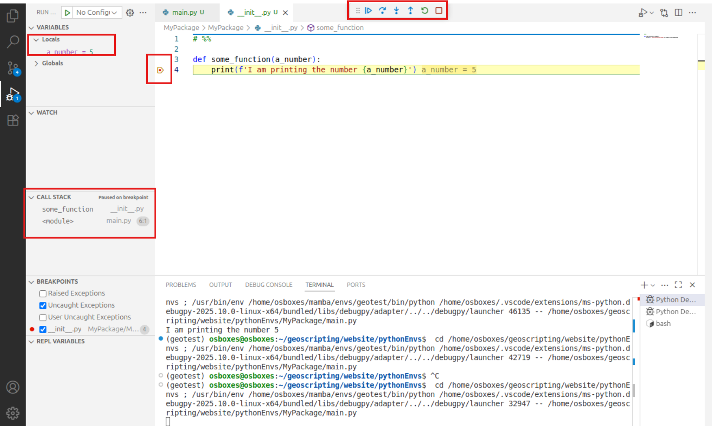</img>

If you step into the function we can find out the real value of the debugger. On the top left panel we can see the local variables, the variables that are known within the function, and the global variables. These are the variables for this module. In the bottom left we can switch to different modules, when clicking on `<module>   main.py` we can inspect the variables known in the script `main.py`. It is directly clear how python handles variables, what is known within a function and what is not. Switch to the `some_function` scope and you can see there is 1 local variable `a_number` which is the input the the function, 5 in this example. When you will start making use of more advanced objects with properties and methods this variable overview will become more elaborate.

#### REPL
Additionally to the debugger, you can play around with code in jupyter style notebooks. You can start the repl by opening the command palette (`Ctrl` + `Shift` + `P`) and type _repl_, and click _'Python: Start Native Python REPL'_. A new window will show up, and if you type some python in the cell that says _Press Enter to execute_, for example `print('hello everybody!!')`. The code you ran shows up in a cell and the output in the cell below. This is how notebooks work, they contain code per cell and show the results in line. 

Notebooks allow you to show visuals inline as well. For example we can show plots or an interactive map, directly in the notebook. Type the following Python code in the code cell:

```{Python,engine.path='/usr/bin/python3', eval=FALSE}
import folium

m = folium.Map(location=[51.9700000, 5.6666700], zoom_start=13)
m
```

Run the code cell by selecting it and pressing the *Run* button, or press *CTRL + Enter* or *Shift + Enter*. You'll see a map visualized below your code, similar to the one below. Try to drag the map to play around with it. 

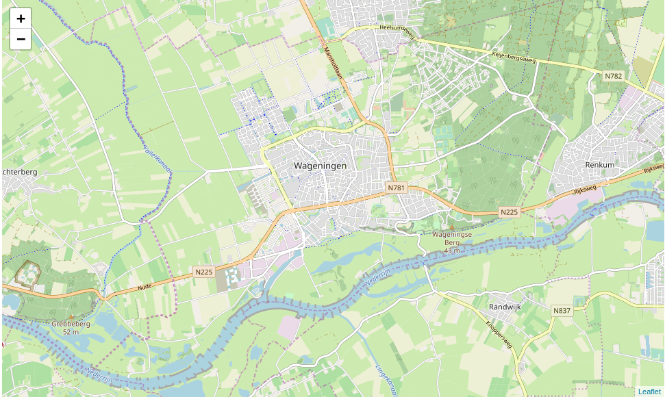</img>


### Using Git source control in VS Code

You've already learned how to use Git in the terminal from previous courses. In this section, we'll show you how to use Git directly within **Visual Studio Code (VSCode)**.

There are two main ways to work with Git in VSCode:

1. **Use the integrated terminal**, just like you did in earlier exercises.  
2. **Use VSCode’s built-in Git interface**, which provides a visual way to interact with Git.

In this tutorial, we will focus more on option 2, as you're already familiar with the command-line approach.


Click on the **Source Control** icon (it looks like a branch) in the left sidebar, or press `Ctrl + Shift + G` to open the Git panel in VSCode.

This interface is especially helpful for beginners who prefer visual feedback or want to avoid typing commands manually — though keep in mind that it may be less efficient than using the terminal.


#### Start from a Git Repository

The initial state of the **Source Control** panel depends on whether you've opened a folder and whether that folder is already a Git repository:

- If **no folder is opened**, you’ll see options to:
  - **Open Folder** (from your local machine)
  - **Clone Repository** (from GitHub or other remotes)

- If a **folder is opened but not initialized as a Git repository**, you’ll see:
  - **Initialize Repository**
  - **Publish to GitHub**

- If you’ve opened a **folder that is already a Git repository**, the panel will show:
  - A blue **Commit** input box on top
  - A `Changes` section listing modified or new files
  - A `GRAPH` section showing the Git commit history in visual form

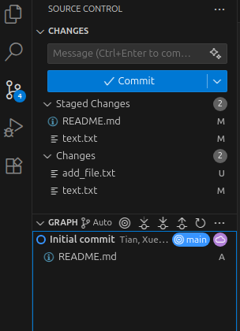</img>


#### `git status` – View modified files

Under the `Changes` section, you'll see all modified, untracked, or staged files. Each file has a status label:

- `U` – Untracked  
- `M` – Modified  
- `A` – Added (staged)

You can click on any file to view the diff — i.e., what lines have been changed — in a side-by-side comparison.

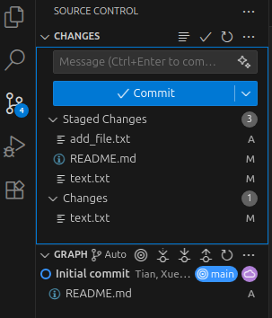</img>


#### `git add` / `git reset` – stage or unstage Files

To **stage** a file (equivalent to `git add`), hover over it and click the **`+`** icon.

To **unstage** a file (equivalent to `git reset HEAD`), hover over it again (now in the **Staged Changes** area) and click the **`-`** icon.

This allows you to control which files you want to include in your next commit.


#### `git commit` – Commit your changes

Once you've staged the desired files, you can commit them:

1. Enter a short commit message in the blue bar at the top.
2. Click the **✓ (checkmark)** icon to commit.

VSCode may open a `COMMIT_EDITMSG` tab for a longer message if needed. You could also fill in the commit message above the commit blue bar. After committing, your changes will appear as a new node in the `GRAPH` panel, showing a visual update to the repository’s commit history.

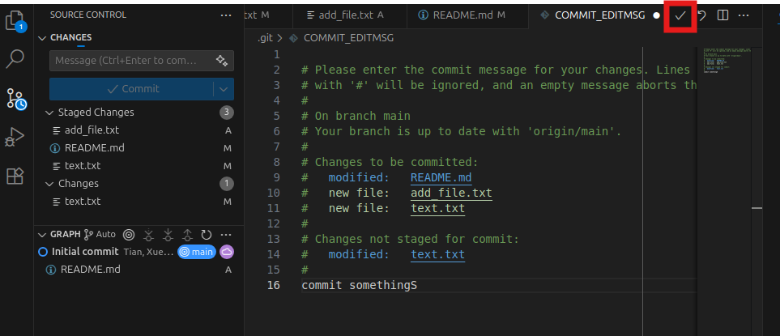</img>

#### `git push` – push local commits to remote

To **push** your local commits to a remote repository (like GitHub), click the `...` (More Actions) menu in the top-right of the Source Control panel, and then select **Push**.

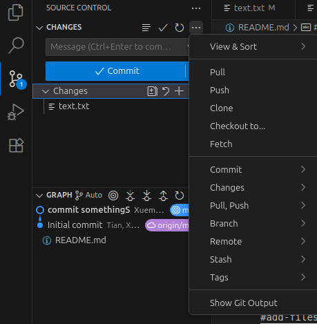</img>

Once done, your changes will be reflected in the remote repository.

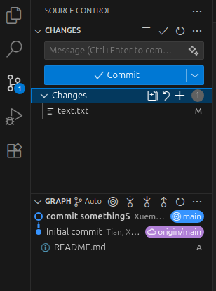</img>

#### `git pull` – download and Merge Remote Changes

To update your local repository with any changes from the remote, open the `...` menu in the Source Control panel and select **Pull**.

In this section, we demonstrate how VS Code handles *artificially created conflicts* (i.e., when the local and remote branches diverge). You don’t need to follow along step-by-step — just observe how it works in the interface. In `GRAPH`, the divergent branches will be shown quite intuitively:

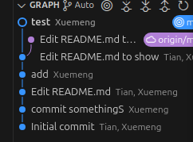</img>

If someone else (or you, on another machine) has pushed changes to the remote, pulling will fetch those changes and attempt to merge them into your current branch. However, if your local branch has diverged from the remote, Git requires a strategy to reconcile them — either by **merging** or **rebasing**. Unlike the terminal, **VS Code does not prompt you explicitly** when this happens. Instead, the pull will fail until you configure your preferred reconciliation strategy. You can set this using the terminal inside VS Code `git config --global pull.rebase false`. After configuring, subsequent pulls will proceed smoothly.

VS Code provides a **3-way merge editor** to help resolve them visually. Files with conflicts will show a **Resolve in Merge Editor** button at the bottom right — click it to open the editor.

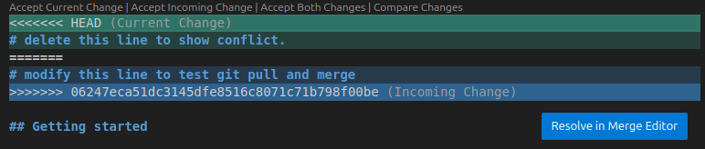</img>

The 3-way merge editor displays:

- Incoming changes (from remote, left side)
- Current changes (your local edits, right side)
- Result (the merged version, bottom)

You can click buttons above each section to choose whether to accept incoming, current, or both changes. 

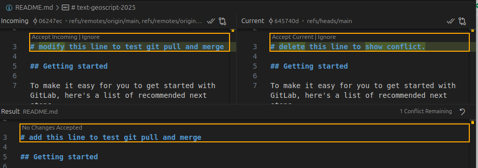</img>

After resolving all conflicts and completing the merge, you’ll see the branches merged back together in the `GRAPH` panel:

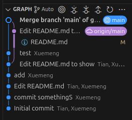</img>

#### More!

The Git operations we covered here are just the basics. VS Code offers many more features through its Source Control panel — from viewing diffs, to switching branches, to managing stashes.

To go further, check out the [tutorial](https://code.visualstudio.com/docs/sourcecontrol/overview#_source-control-graph) on using Source Control panel.


### Extra material
The functionality we showed now only touch a very small tip of the iceberg of all that VSCode has to offer, but it is enough to follow the course and start writing some python code. If you want to explore more, below are some resources to get you started. It is easy to complicate the IDE a lot, it is recommended to start with some basics and only start adding more when you are comfortable with the basics.

  - [Official VSCode documentation](https://code.visualstudio.com/docs/python/python-tutorial)
  - [Cheat sheet with keyboard shortcuts](https://code.visualstudio.com/shortcuts/keyboard-shortcuts-linux.pdf)
  - [A cool interactive python feature](https://www.youtube.com/watch?v=lwN4-W1WR84)
  

## Different ways to run notebooks

We have seen how we can use notebooks in the REPL, but there are different ways and this is the power of notebooks. Originally, notebooks were introduced by Jupyter. 

### Jupyter Notebook

Jupyter Notebook is actually not a IDE but it is very useful for writing code. Jupyter stands for the languages that once can use (*JU*lia, *PY*thon and *R*) and notebooks means that they are actually files instead of an IDE (such as Rstudio or Spyder). The notebooks can be interpreted and run by varying interpreters of which we will cover two later on. Jupyter Notebook integrates code and visualization, and are therefore very helpful for demonstration purposes and to be run by online interpreters (such as Google Colab). First we will show how to run Jupyter Notebook locally. To do this install `jupyter` and the module `folium` in an existing or new environment that includes Python. To start Jupyter type in the terminal:

```{bash, eval=FALSE}
jupyter notebook
```

Jupyter should pop up in your browser. Note that although jupyter is opened in your browser, internet is not used, the code is interpreted and run locally. You will see a menu with all files in your working directory. The Jupyter Notebook will only see files that are accessible from the working directory in which you launched the notebook!

Make a new folder: *New* → *Folder*, rename the folder (check the box next to the new 'Untitled Folder' and click **'Rename'** in the top) and, in this folder, create a new Python3 Jupyter Notebook *New* → *Python 3*. Give your notebook a name by clicking on *untitled*. Note that this creates a file with the extension *.ipynb*, short for 'Interactive Python Notebook', which is the file format of Jupyter Notebook. 

Feel free to have a go at the user interface tour (*Help* → *User Interface Tour*), or hover over the toolbar to check out the tools. The main tools are:

- _Save and checkpoint_
- _Insert cell below_
- _Run_
- _Code/Markdown/Heading_ (List box)


### Google Colab
As said before, Jupyter is locally opened in your browser. It does not connect to the internet, but it does show the possibilities, one could create something online that can run your notebooks for you on the cloud. This is exactly what Google does with Google Colab. Google Colab is a cloud service that allows you to run your Jupyter notebooks on the Google cloud for free. Let's see what this looks like: 

* Go to https://colab.research.google.com/notebooks/empty.ipynb (note the similaritie and differences between Jupyter locally and on Google Colab);
* Type `!pip install folium` and press ctrl+enter to run and  install folium;
* In a new cell run the same python code as locally to create and show a new folium map.

For this course we will rarely use Jupyter Notebook and or Google Colab, but it is good to know they exist. Especially Google Colab is being used more and more in the scientific community and you are likely to come across these during other courses. 

### Spyder

Spyder is a IDE for developing python mainly for scientific purposes. Fun fact, it is [completely written in python](https://github.com/spyder-ide/spyder)! Spyder is a very complete IDE that looks a bit like Rstudio. It shows the variables present in the current session, it has a code editor, a console and a figures pane in the main view. 

The [Spyder IDE](https://docs.spyder-ide.org/) can be started in a terminal when the *Spyder* package is installed in the active conda environment. So, using *Mamba*, make an environment and install Spyder to that environment. Activate the environment. Spyder will automatically make use of the Python interpreter of the active conda environment. To start Spyder:

```{bash, eval=FALSE}
spyder
```

In Spyder you should see an editor, a file explorer and a console. Have a look at the toolbar. Some important shortcuts are:

* F5 to run your script
* CTRL + S to save your script
* CTRL + 1 to comment/uncomment your code
* TAB to indent your code
* SHIFT + TAB to unindent your code

Open a new file and save it somewhere as `main.py` (File -- > New File --> Save As). Test writing a few lines of code and running the script.


# Putting it to the test

## Setting up the environment

Now that we know how to set up an environment and run code, lets use this new knowledge and run some Python code. Again, during this course advise you to code in VSCode, as this IDE is the recommended IDE for the Python part of this course. 

Create a directory structure for this tutorial using the terminal:

```{r, eval=FALSE,engine='bash'}
cd ~/Documents/
mkdir PythonRefresher #or give the directory a name to your liking
cd ./PythonRefresher
mkdir output
```

And open it with VSCode by clicking _File_ and _Open Folder_. 

We only made a directory for output, because no input data or separate scripts are created in this tutorial. Next, we will create a conda environment from a file. First create a text file, (re)name it (to) `refresher.yaml`, and copy the following content into the file:

```
name: refresher
dependencies:
  - python
  - numpy
  - matplotlib
  - geopandas
  - spyder
```

Now, create a new conda environment based on this file. You can do this in a ubuntu terminal, or a terminal in VSCode. To open the terminal in VSCode press `Ctrl` + `shift` + `P` and type terminal and select _Create New Terminal (With Profile)_

```{bash, eval=FALSE}
mamba env create --file refresher.yaml
```

Once everything is installed, associate the refresher environment to this project. The easiest way is press `Ctrl` + `shift` + `P` and type _Python: select interpreter_. 

Create a new Python script and save it. 

Important to note: for compatibility, it is best to install packages from the same channel as much as possible. Given that packages in the file `refresher.yaml` are installed from the `conda-forge` channel, it is wise to use this same channel when you want to install additional packages in your environment. 


## Quick refresher
In the tutorial about R and Python we have gone over the differences and similarities of python and R. This tutorial also contains some basic python syntax, in this tutorial we assume you know this content, but we will go over a few basics here as well. The examples below are mostly meant for reference purposes, we  assume you understand most of this refresher already. 

### Printing and basic data types
In Python we assign variable using the equals sign (`=`):

Printing in Python is done using the `print` function. We can print variables directly: 

```{r, engine = 'Python', eval=FALSE}
# Integer
age = 25

# Float
height = 1.75

# String
name = "John Doe"

# Boolean
is_student = True

# Print a name
print(name)
```

We can use string formatting to use flexible strings, for example for printing. to start a formatted string, we put a `f` before the string. We can use curly brackets `{}` in this formatted string. The text between these curly brackets is executed as regular Python code. 

```{r, engine = 'Python', eval=FALSE}
# String formatting and printing 
print(f'{name} is {age} years old and is {height} meters tall.')
```

### Basic arithmetic operations:
```{r, engine = 'Python', eval=FALSE}
a = 10
b = 5

addition = a + b
subtraction = a - b
multiplication = a * b
division = a / b
modulo = a % b
exponentiation = a ** b

print(addition, subtraction, multiplication, division, modulo, exponentiation)
```


### Conditional statements
```{r, engine = 'Python', eval=FALSE}
x = 15

if x > 10:
    print("x is greater than 10")
elif x == 10:
    print("x is equal to 10")
else:
    print("x is less than 10")
```


### Loops (for and while)
```{r, engine = 'Python', eval=FALSE}
# For loop
for i in range(5):
    print(i)

# While loop
count = 0
while count < 5:
    print(count)
    count += 1
```

### Lists and basic list operations
```{r, engine = 'Python', eval=FALSE}
# Creating a list
fruits = ["apple", "banana", "orange"]

# Accessing elements
print(fruits[0])  # Output: "apple"

# Adding elements
fruits.append("grape")

# Removing elements
fruits.remove("banana")

# Length of the list
print(len(fruits))  # Output: 3
```


### Functions
```{r, engine = 'Python', eval=FALSE}
# Function to add two numbers and return the result
def add_numbers(a, b):
    return a + b

result = add_numbers(5, 3)
print(result)  # Output: 8
```

Functions can be used to automate tedious tasks that you do often. Some examples would be creating directories if they don't exist, or downloading and unzipping files. For example: 

```{python, engine = 'Python', eval=FALSE}
import os
def make_directory(directory_name):
    # Check if directory already exists
    if not os.path.exists(directory_name):
        os.mkdir(directory_name)

```

```{python, engine = 'Python', eval=FALSE}
import requests
import zipfile
import os

def download_and_unzip(url: str, extract_to: str = "."):
    """
    Downloads a ZIP file from a URL and extracts it.
    This function was written by ChatGPT and edited and checked for correctness by Arno Timmer

    Args:
        url (str): The URL to the ZIP file.
        extract_to (str): Directory where the files will be extracted.
    """
    # Get filename from URL
    local_zip_path = os.path.join(extract_to, url.split("/")[-1])

    # Download the file
    response = requests.get(url)
    response.raise_for_status()

    with open(local_zip_path, "wb") as f:
        f.write(response.content)

    # Extract the zip file
    with zipfile.ZipFile(local_zip_path, "r") as zip_ref:
        zip_ref.extractall(extract_to)

    # remove the zip file
    os.remove(local_zip_path)
```

As you can see functions don't need to return something, but can also return multiple things. If they do, be careful to also store the returned values in multiple variables! If not, they are stored as a tuple.

```{r, engine = 'Python', eval=FALSE}
def multiply_value(a):
    ''' 
    This function multiplies value a with 100 and with 1000. It returns both the results.
    '''
    hundredfold = 100 * a 
    thousandfold = 1000 * a
    return hundredfold, thousandfold

# When called like this both values are stored as a tuple
results = multiply_value(5)
print(type(results))
print(f'We calculated the hundredfold of a number: {results[0]} and the thousandfold: {results[1]}' )

# But we can also call it like this:
hundreds, thousands = multiply_value(10)
print(f'We calculated the hundredfold of a number: {hundreds} and the thousandfold: {thousands}' )
```
### Dictionaries
```{r, engine = 'Python', eval=FALSE}
# Creating a dictionary
person = {
    "name": "Alice",
    "age": 30,
    "is_student": FALSE
}

# Accessing values
print(person["name"])  # Output: "Alice"

# Adding a new key-value pair
person["occupation"] = "Engineer"

# Removing a key-value pair
del person["is_student"]
```


### Importing packages
Python is used by a very large community, as is said before. One of the reasons for this is that this entire community builds a lot of (open source) packages. It is therefor very useful to be able to build upon these packages. In R you have worked a with *dataframes* and *spatial dataframes*. In Python these are not standard datatypes, but they are implemented in very well known packages called `Pandas` and its spatial counterpart `GeoPandas.` We will go in much more detail during the Python-Vector tutorial but we will introduce them quickly here. 

In Python we import a package using the `import` statement (instead of th the `library` function in R) . For example importing the pandas package goes as follows:

```{r, engine = 'Python', eval=FALSE}
import pandas as pd
```

As you can see we can import a package *as* something. We use this if we want to point at specific functionality of this package. If we want to point at for example the `read_csv` function from pandas we we call `pd.read_csv`. This function is also implemented in other packages, but now we are sure we use the pandas version of this function. Importing pandas is a convention, used very widely in the python community. 

We can create a `dataframe` as follows: 
```{r, engine = 'Python', eval=FALSE}
data = {
    'Name': ['Alice', 'Bob', 'Charlie'],
    'Age': [25, 30, 22],
    'City': ['New York', 'San Francisco', 'Chicago']
}

df = pd.DataFrame(data)
print(df)
```   

We can access some information from this `dataframe` as follows:

```{r, engine = 'Python', eval=FALSE}
# Display the first few rows of the DataFrame
print(df.head())

# Get statistical information about the DataFrame
print(df.describe())

# Access a specific column
print(df['Age'])
```   

### GeoDataFrame
The spatial counterpart of a `dataframe` is a 'GeoDataFrame', which we normally import *as* `gpd`: 
```{r, engine = 'Python', eval=FALSE}
import geopandas as gpd

# Dummy data for the GeoDataFrame
data = {
    'Name': ['Location A', 'Location B', 'Location C'],
    'Latitude': [40.7128, 34.0522, 41.8781],
    'Longitude': [-74.0060, -118.2437, -87.6298]
}

# Create the GeoDataFrame with a single line of code
gdf = gpd.GeoDataFrame(data, geometry=gpd.points_from_xy(data['Longitude'], data['Latitude']))

# Display the GeoDataFrame
print(gdf)
```


# Python help

There are several ways to find help with programming in Python. Searching the internet typically solves your problem the quickest, because it finds answers on multiple platforms, such as StackOverflow and GitHub. During Geoscripting we have the forum to ask and give help. Asking your friends or colleagues in person is also a great way to learn and fix programming problems. Another good option is get documentation from the package website or inside Python:

```{Python,engine.path='/usr/bin/python3', eval=FALSE}
import sys
help(sys)
```

See how the objects and functions in the `sys` package got listed.

```{block, type="alert alert-success"}
> **Question 4**: What kind of functionality does the `sys` package provide?
```

# More info
- [Official Python tutorial](https://docs.Python.org/3/contents.html)
- [Python Style guide ](https://www.python.org/dev/peps/pep-0008/)
- [Python 3 Cheatsheet](https://ugoproto.github.io/ugo_py_doc/py_cs/)
- [Overview Python package Cheatsheets](https://www.datacamp.com/community/data-science-cheatsheets?tag=python)

# Sources used:
- [Carpenters introduction to pixi](https://carpentries-incubator.github.io/reproducible-ml-workflows/pixi-intro.html)
- [pixi documentation](https://pixi.prefix.dev/latest/)